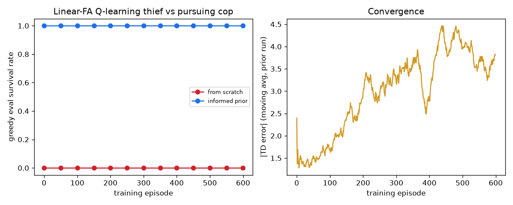
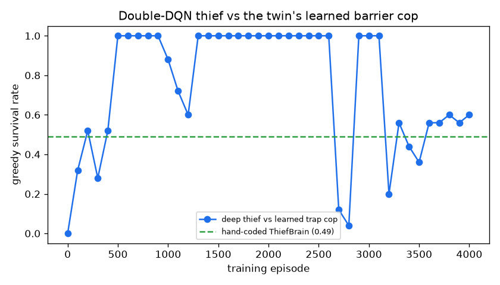
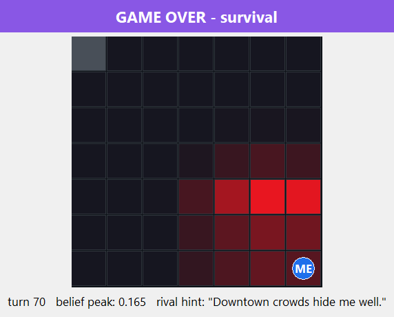

# P2P-Thief — the Thief agent

Autonomous **Thief** agent for the distributed Cops-and-Robbers game, played
peer-to-peer over FastMCP with **no central server and no judge**. Integrity comes from
mathematics: a SHA-256 commit-reveal protocol seals every half-turn, and a mutual
end-of-game audit exposes any rewriting of history.

> **Sibling repository** (the Police/Cop agent of team `anrbj666`):
> **https://github.com/alonengel/P2P-Police**

Team: Alon Engel, Renat Karimov · Course: Orchestration of AI Agents (Univ. of Haifa)

---

## Part I — User manual

### Installation

Requirements: Python ≥3.13, [uv](https://docs.astral.sh/uv/). Two supported setups:

```bash
# A) fresh machine
git clone https://github.com/alonengel/P2P-Thief && cd P2P-Thief
uv sync                      # creates .venv, installs locked deps

# B) full twin-repo workspace (recommended for development)
git clone https://github.com/alonengel/P2P-Thief
git clone https://github.com/alonengel/P2P-Police  # side by side
```

Troubleshooting: `port 8801 is busy` → another peer instance is alive; stop it or
change `[network].my_port` in `config/game.toml`. `unsupported schema_version` →
your `game.json` generation is unknown to `shared/version.py` — negotiate a
supported one. Gmail errors → see `docs/DEPLOYMENT.md` (tokens expire!).

### Usage

```bash
uv run p2p-thief peer                 # play one game vs the configured opponent
uv run p2p-thief peer --gui           # + live local-truth view (belief heatmap)
uv run p2p-thief peer --gui --gui-screenshot assets/live.png
uv run p2p-thief verify-log --log results/log_<game>.json   # Verified OK / TAMPERED
uv run p2p-thief replay --log results/log_<game>.json       # visual replay witness
uv run p2p-thief --version

# Research reproduction (RL campaign - see Part II section 3 + PRD_08):
uv run python scripts/train_rl.py          # linear Q-learning, both curves
uv run python scripts/train_deep_rl.py     # Double-DQN evader vs learned trap cop
uv run python scripts/finetune_deep_rl.py  # gated warm-start fine-tune (knife-edge)
uv run python scripts/run_sensitivity.py   # OAT sensitivity experiments
```

Cross-repo match on one machine: `powershell -File ../run_cross_match.ps1`.
Public play + Gmail setup: `docs/DEPLOYMENT.md`. League duties: `docs/LEAGUE_RUNBOOK.md`.

### Configuration

| File | Role |
|---|---|
| `config/game.json` | THE signed constitution — every agreed value (Appendix ו). Byte-identical on both sides, SHA-256-locked at negotiation; fixed values enforced at load |
| `config/game.toml` | Private: identity, ports, opponent URL, `[strategy]` brain override, `[trash_talk]` provider, `[email]` mode. JSON always overrides TOML |
| `config/rate_limits.json` | Gatekeeper triad limits per service (versioned) |
| `config/games/` | Archived per-game configs (rules 3-4) |

### Quality gates & contribution

TDD; ruff zero-violations; coverage ≥85% (branch); **≤150 code lines per file**
(`scripts/check_line_cap.py`); twin physics parity (`scripts/check_physics_parity.py`);
conventional commits; pre-commit hooks + CI enforce all of it. Secrets never enter
the repo (`.gitignore` + gitleaks in CI; `.env-example` shows the shape).

---

## Part II — Academic report

### 1. The Dec-POMDP model

The race is a decentralized partially observable Markov decision process
⟨n, S, {Aᵢ}, P, R, {Ωᵢ}, O, γ⟩:

- **n = 2** — every decision is weighed against a single *rational rival*, not nature.
- **S** — cop and thief coordinates, the barrier layout, and both dynamic scent
  fields. Brute-force enumeration is infeasible — the fact that drove our
  algorithm choices (§3).
- **{Aᵢ}** — movement (orthogonal + STAY), *construction* (the cop's barriers),
  and *communication* (≤15-word hints that may lie): physics and psychology in
  one action space.
- **P** — deterministic physics that both sides must compute identically; with no
  server, P **is** the signed `game.json` + the parity-locked `domain/` code.
- **R** — the fixed scoring table (capture 20/5, survival 5/10, tie 2).
- **{Ωᵢ}** — each side observes only its own state, the rival's decaying scent
  field, and the rival's hint. Our belief map (§3) lives here.
- **O** — the observation function is **the only channel of deception**: hints
  bend O, scent cannot (it is an unforgeable byproduct of movement).
- **γ** — implicit long-horizon patience: barrier traps pay off many turns later.

### 2. FastMCP orchestration dilemmas

Each peer is simultaneously an MCP **server** (four dumb-door tools: `negotiate`,
`receive_turn`, `submit_audit`, `receive_control` → thread-safe inboxes) and a
**client** to the opponent's single known URL. Design decisions and their whys:

- **Replicated engines, lockstep application.** Both sides run the same physics
  and apply both half-turns locally; end-state digests prove convergence.
- **Persistent sessions.** Per-call MCP sessions die through tunnels
  ("Session terminated" — learned live, `docs/DEPLOYMENT.md`); one long-lived
  session per opponent, rebuilt only on failure.
- **Deadlines everywhere** (rule 6): every awaited message and every in-flight
  call is bounded; lapses route the strict turn state machine
  (WAITING→COMPUTING→COMMITTING→AWAITING_REVEAL→VERIFYING) into terminal
  TECHNICAL_LOSS instead of deadlock.
- **Gatekeeper + Orchestrator** (ch. 8/9): ALL external calls (LLM, Gmail) pass
  one doorway — token bucket, daily quota, DOS circuit breaker; the SDK facade
  is the single entry to business logic.
- **Commit order is negotiated** — an explicit agreement field, because two
  correct-but-different implementations would deadlock forever.
- **The three classic orchestration failures** (course L09 framing) and our
  antidotes: *task duplication* — impossible, roles are disjoint by
  construction; *contradictory outputs* — replicated engines + end-state
  digests + mutual audit force one truth; *convergence failure* — strict
  turn alternation with deadlines makes unbounded loops unrepresentable.
  (MCP is the project's mandated protocol; A2A and ACP are the complementary
  standards worth knowing for lifecycle handoff and zero-trust fleets.)
- **A cross-team protocol contribution.** Reviewing another team's draft league
  protocol (ImreEyal's interop kit), we identified that per-step commits —
  strong against editing one step — leave a whole log re-forgeable offline,
  and designed the fix: a `prev`/`prev_recv` hash interlock chaining both
  sides' records into one tamper-evident DAG, making earliest divergence
  provable from the two committed logs. The kit adopted it as its flagship
  opt-in enhancement ("Design credit: anrbj666"). We deliberately do NOT run
  it in counted games: it modifies the sealed record — the most
  disqualification-sensitive layer (rule 19) — for a guarantee the book does
  not require and only an opting-in opponent benefits from. The same review
  exchange surfaced the reference's byte-forms we aligned to (ADR-0004) and
  its settlement-signature quirk our conformance suite now pins.

### 3. The chosen strategy

Moves are **always pure Python** (the LLM only writes banter). The shipped
evasion brain, `strategy/thief_brain.py`:

1. **Bayesian belief map** over the cop (parity-locked `domain/belief.py`):
   per turn — movement diffusion × scent likelihood × hint likelihood.
2. **Scent-grounded lie detection** (book ch. 4): a claimed region whose
   freshest trail falls below the (1−ρ)·0.9 ≈ 0.81 expectation flips the hint's
   weight — belief re-aims at the *evidence*, not the words.
3. **Survival-clock evasion**: maximize the barrier-aware BFS distance from the
   cop's believed position — true escape distance, not Manhattan optimism.
4. **Corner aversion**: ties break toward open ground (more passable
   neighbors), because a cornered thief is a captured thief (rule 47) and
   every barrier shrinks the safe area.
5. **One-ply adversarial wall forecast** (exact-information play only): the
   book limits barrier placement to one step from the cop's own cell (p. 37),
   so every candidate landing is scored by the escapes/region surviving the
   cop's BEST legal wall next turn, plus wall-distance aversion (trap cops
   harvest wall-huggers). Measured effect: survival vs the learned trap cop
   0.50 → **1.00** over 100 games with zero regressions
   (`results/experiments/thief_forecast_benchmark.json`). The forecast is
   deliberately GATED to exact information — fed a stale believed cell it
   dodges phantom walls and dies (measured 1.00 → 0.00 vs the heuristic trap
   cop) — so belief-mode play stays conservative: an information-aware
   strategy, not a blanket one.

Measured: evasion survives a random cop ≥20/25 (blind: ≥15/25) and, in the
blind cross-repo match, ran the full 35-turn clock against the pursuit twin
that had captured it in 13 turns under full information — **uncertainty is the
thief's best weapon, working exactly as the rulebook intends**.

**Reinforcement learning (optional path, implemented):** a linear-FA
Q-learner (`strategy/rl_brain.py`, TD(0), ε-greedy) exposes a genuinely
interesting asymmetry, and BOTH sides of it are now recorded runs in
`results/experiments/rl_training.json` and overlaid in the curve below:
**from-scratch evasion fails** (flat 0% survival across all 600 episodes,
red — one corner mistake is terminal and capture ends every episode before
the first +1 is ever observed: a classic hard-exploration problem), while
from an informed prior encoding the heuristic's features RL **maintains 1.00
survival and amplifies exactly the right weights** (distance 1.0→2.4,
escape-openness 0.5→1.5; 50-game evals, dedicated eval RNG). Pursuit, by
contrast, trains from zero to 1.00 (see the twin repo) — chasing is easy to
learn, escaping must be taught:



Loadable via `[strategy] thief_class = "p2p_thief.strategy.rl_brain:LinearQBrain"`
(exercised end-to-end by `tests/unit/test_strategy/test_rl_brain.py`);
the hand-tuned ThiefBrain remains the league default.

**Deep RL closes the arms race (`strategy/rl_deep.py`).** The twin repo's
Double-DQN cop *learns barrier trapping* — 0.74 capture vs a perfect
movement-evader, tying its hand-engineered tactics (0.73). That makes the
linear evasion brain's training regime obsolete: it never faced a barrier in
training. So the thief now trains a **Double-DQN evasion MLP
(9→tanh(12)→1, pure Python) against exactly that learned trap cop** —
`strategy/arena_cop.py` replays the twin's trained cop from copied weight
*data* with locally duplicated logic (mirrored-twin rule: no cross-repo
imports, no shared live state; static duplication is the sanctioned
mechanism). Features track precisely what traps destroy: escape routes,
reachable region, wall distance, barrier density, chase parity. Result,
100 held-out games vs the learned trap cop:

| Policy | Survival vs learned trap cop |
|---|---|
| Random-init net (episode 0) | **0.00** |
| Hand-coded ThiefBrain | **0.49** |
| **Learned Double-DQN thief (best checkpoint)** | **1.00** |



The learned evader **fully neutralizes** the adversary that halves the
hand-coded brain's survival — with the honest caveats recorded in
`results/experiments/deep_rl_training.json`: the 1.00 is against a *fixed*
deterministic adversary (counter-policy exploitation, not a universal
guarantee), and the training curve collapses late (1.00 → 0.20, catastrophic
forgetting) which is why the shipped weights are the best-eval checkpoint.
ThiefBrain stays the league default; the deep brain loads via
`[strategy] thief_class = "p2p_thief.strategy.rl_deep:DeepQBrain"`.

**Round 2 — the specialist beats the generalist.** The twin retrained its
cop against our counter-evader (ensemble + belief-noise, its v3): it kept
0.74 vs the perfect evader but **still captures our v1 evader 0.00** —
verified independently from this repo: **v1 survives cop v3 at 1.00 over
100 games**. Our own attempt to make the evader *robust* the same way
(ensemble of trap cops + belief-noise,
`results/experiments/deep_rl_training_v2_ensemble.json`) **collapsed to
0.06** — a deliberately recorded negative result: robustness training is
not a free lunch, and the shipped weights remain the v1 specialist. A
follow-up warm-start fine-tune (from v1, lr 0.003, hard promotion gate —
`results/experiments/deep_rl_finetune.json`) sharpened the finding into a
knife-edge theorem-in-practice: v1 survives **1.00 with exact opponent
information and 0.00 under radius-2 belief noise**, and even the gentlest
retraining collapses the specialist within ~100 episodes. A third gated
attempt — lag-1-NATIVE training on the actual hidden-play signal
(`deep_rl_hidden_training.json`) — peaked at 0.21 and failed its gate too:
three independent regimes now agree the gap is structural. Evasion at this
level *requires* exact information — which is the evidence-backed reason
the robust hand-coded ThiefBrain stays league default. Net outcome of the
two-round arms race: the evader holds the structural advantage at this
barrier budget, exactly as pursuit-evasion theory predicts.

### 4. Screenshots (mandatory evidence, from real cross-repo games)

| Live GUI — local truth only | Replay witness |
|---|---|
|  |  |
| Belief heatmap (deeper red = higher P(cop)), ME marker, turn banner, rival's hint | Green **Verified OK (70 sealed steps)** over the reconstructed game |

`verify-log` on the same log: genuine → `Verified OK`; one rewritten move →
`TAMPERED` (exit 1).

### 5. Quality mapping (ISO/IEC 25010)

Functional suitability — milestone-gated PRDs 01-07, 150+ tests. Reliability —
deadlines, watchdog-style FSM exits, session rebuilds, 20-seed self-play.
Performance — template provider plays whole series at 0 LLM tokens. Security —
send-only OAuth scope, secrets outside the repo, gitleaks CI, commit-reveal
integrity. Maintainability — SDK layering, ≤150-line files, per-mechanism PRDs,
ADRs incl. documented book contradictions. Portability — uv-locked, stdlib+httpx
core. Compatibility — byte-locked shared config + golden physics vectors across
twins. Usability — one-command flows, local-truth GUI, actionable errors.

### 6. Course anchors

L09 (two agents over MCP calling external tools) → the peer architecture;
L11 (stigmergy, no central control) → the scent/belief loop; L05 (orchestrator,
skills, observability) → SDK + gatekeeper + GUI/replay; L02/L04/L08 → the
verbal-layer providers (template/Ollama/Claude/OpenRouter).

## License & credits

MIT — see [LICENSE](LICENSE). Architectural patterns studied from the official
course example repo (rmisegal/Game-P2P-Cop-Chase) under its educational terms;
where they differ, the rulebook and its Appendix ו govern.
